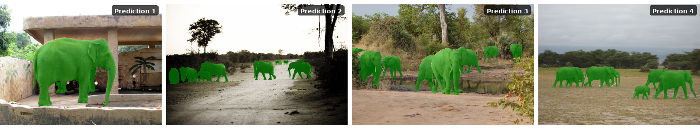
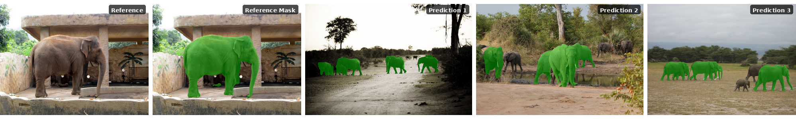

# Introduction

The Geti Instant Learn Library provides a robust platform for experimenting with visual prompting techniques. Its modular pipeline design allows researchers and developers to easily combine, swap, and extend components such as backbone networks, feature extractors, matching algorithms, and mask generators.

## Installation

```bash
cd library

# Intel XPU
uv sync --extra xpu

# CPU only
uv sync --extra cpu

# With CUDA support
uv sync --extra gpu
```

<details>
<summary><strong>Advanced: Optional dependencies</strong></summary>

```bash
# Install development dependencies
uv sync --extra dev

# Install notebook support
uv sync --extra notebook

# Install quantization tools (NNCF) - only required when needed to run model conversion (quantisation)scripts 
uv sync --extra quantize

# Install all dependencies
uv sync --extra full
```

</details>

## Quick Start

### Python API

#### SAM3: Zero-Shot Text Prompting

SAM3 performs zero-shot segmentation using text prompts (category names) or bounding boxes — no reference mask needed.

<p align="center">
  
</p>

```python
from instantlearn.models import SAM3
from instantlearn.data import Sample

model = SAM3(device="xpu")  # or "cuda", "cpu"

predictions = model.predict([
    Sample(image_path="examples/assets/coco/000000286874.jpg", categories=["elephant"]),
    Sample(image_path="examples/assets/coco/000000173279.jpg", categories=["elephant"]),
])
```

> **Tip:** `model.fit(sample)` is optional — if called, categories are reused for all
> subsequent `predict()` calls. Otherwise, categories are taken per sample.

For more examples, see the [SAM3 aerial & maritime notebook](examples/sam3_aerial_maritime_example.ipynb).


<details>
<summary><strong>Box / point prompting</strong></summary>

```python
import numpy as np

# Box prompt — segment an elephant ROI
target = Sample(
    image_path="examples/assets/coco/000000286874.jpg",
    bboxes=np.array([[180, 105, 490, 370]]),
    categories=["elephant"],
    category_ids=[0],
)
predictions = model.predict(target)

# Point prompt — click on an object
target = Sample(
    image_path="examples/assets/coco/000000286874.jpg",
    points=np.array([[335, 240]]),
    categories=["elephant"],
    category_ids=[0],
)
predictions = model.predict(target)
```

</details>

<details>
<summary><strong>Visual exemplar mode — fit on reference, predict on any target</strong></summary>

```python
from instantlearn.models.sam3 import Sam3PromptMode

model = SAM3OpenVINO(
    variant=SAM3OVVariant.FP16,
    prompt_mode=Sam3PromptMode.VISUAL_EXEMPLAR,
    device="CPU",
)

# Fit: encode reference image bounding boxes
ref = Sample(
    image_path="examples/assets/coco/000000286874.jpg",
    bboxes=np.array([[180, 105, 490, 370]]),
    categories=["elephant"],
    category_ids=[0],
)
model.fit(ref)

# Predict: detect similar objects on new images (no prompts needed)
predictions = model.predict([
    Sample(image_path="examples/assets/coco/000000390341.jpg"),
    Sample(image_path="examples/assets/coco/000000267704.jpg"),
])
```

</details>

<details>
<summary><strong>SAM3 OpenVINO: Optimized Inference</strong></summary>

`SAM3OpenVINO` runs SAM3 on OpenVINO IR models for faster CPU/GPU inference without PyTorch at runtime.
Pre-exported models are auto-downloaded from [HuggingFace](https://huggingface.co/rajeshgangireddy/exported_sam3).

| Variant | Enum | Precision | Recommended Use |
| ------- | ---- | --------- | --------------- |
| FP16 | `SAM3OVVariant.FP16` | Half-precision float | Default — balanced speed and accuracy |
| FP32 | `SAM3OVVariant.FP32` | Full-precision float | Maximum accuracy, debugging |
| INT8 | `SAM3OVVariant.INT8` | 8-bit integer (NNCF) | Faster inference, good accuracy |
| INT4 | `SAM3OVVariant.INT4` | 4-bit integer (NNCF) | Maximum compression, fastest |

**Device support:** `"CPU"`, `"GPU"` (Intel iGPU/dGPU), or `"AUTO"`.
PyTorch-style names (`"xpu"`, `"cuda"`) are mapped to the OpenVINO `"GPU"` device automatically.

```python
from instantlearn.models import SAM3OpenVINO
from instantlearn.models.sam3 import SAM3OVVariant
from instantlearn.data import Sample

model = SAM3OpenVINO(variant=SAM3OVVariant.FP16, device="CPU")

predictions = model.predict([
    Sample(image_path="examples/assets/coco/000000286874.jpg", categories=["elephant"]),
])
```

See [examples/sam3_openvino_example.py](examples/sam3_openvino_example.py) for all 7 example scenarios
and [examples/sam3_openvino_variant_comparison.ipynb](examples/sam3_openvino_variant_comparison.ipynb) for
a side-by-side quality and latency comparison across model variants.

</details>

#### Matcher: One-Shot Visual Prompting

Matcher fits once with a reference mask (one-shot) and predicts on any number of new images without providing prompts again.

<p align="center">
  
</p>

```python
from instantlearn.models import Matcher
from instantlearn.data import Sample

model = Matcher(device="xpu")

ref_sample = Sample(
    image_path="examples/assets/coco/000000286874.jpg",
    mask_paths="examples/assets/coco/000000286874_mask.png",
)
model.fit(ref_sample)

predictions = model.predict([
    "examples/assets/coco/000000390341.jpg",
    "examples/assets/coco/000000173279.jpg",
    "examples/assets/coco/000000267704.jpg",
])
```

<details>
<summary><strong>Generate a reference mask interactively with SAM</strong></summary>

```python
import torch
from instantlearn.components.sam import SAMPredictor
from instantlearn.data.utils import read_image

ref_image = read_image("examples/assets/coco/000000286874.jpg")

# Available models: "SAM-HQ-tiny", "SAM-HQ", "SAM2-tiny", "SAM2-small", "SAM2-base", "SAM2-large"
predictor = SAMPredictor("SAM-HQ-tiny", device="xpu")

predictor.set_image(ref_image)
ref_mask, _, _ = predictor.forward(
    point_coords=torch.tensor([[[280, 237]]], device="xpu"),
    point_labels=torch.tensor([[1]], device="xpu"),
)

# Fit and predict with the generated mask
model = Matcher(device="xpu")
model.fit(Sample(image=ref_image, masks=ref_mask[0]))
predictions = model.predict(Sample(image_path="examples/assets/coco/000000390341.jpg"))
```

</details>

<details>
<summary><strong>Text-based prompting with GroundedSAM</strong></summary>

```python
from instantlearn.models import GroundedSAM
from instantlearn.data import Sample

model = GroundedSAM(device="xpu")
model.fit(Sample(categories=["elephant"]))

predictions = model.predict(Sample(image_path="examples/assets/coco/000000390341.jpg"))
masks = predictions[0]["pred_masks"]
boxes = predictions[0]["pred_boxes"]
labels = predictions[0]["pred_labels"]
```

</details>

<details>
<summary><strong>Customizing Encoder and SAM Models</strong></summary>

```python
from instantlearn.models import Matcher
from instantlearn.utils.constants import SAMModelName

# Lighter model for faster inference
model = Matcher(device="xpu", encoder_model="dinov3_small", sam=SAMModelName.SAM_HQ_TINY)

# Heavier model for best accuracy
model = Matcher(device="xpu", encoder_model="dinov3_huge", sam=SAMModelName.SAM_HQ)
```

**Available encoder models:**

| Model | Description |
| ----- | ----------- |
| `dinov3_small` | DINOv3 Small (fastest, lowest memory) |
| `dinov3_small_plus` | DINOv3 Small+ |
| `dinov3_base` | DINOv3 Base (balanced) |
| `dinov3_large` | DINOv3 Large (default, best accuracy) |
| `dinov3_huge` | DINOv3 Huge (highest accuracy, most memory) |

**Available SAM models:**

| Model | Description |
| ----- | ----------- |
| `SAMModelName.SAM_HQ_TINY` | SAM-HQ Tiny (default, fast) |
| `SAMModelName.SAM_HQ` | SAM-HQ (higher quality masks) |
| `SAMModelName.SAM2_TINY` | SAM2 Tiny (newest architecture) |
| `SAMModelName.SAM2_SMALL` | SAM2 Small |
| `SAMModelName.SAM2_BASE` | SAM2 Base |
| `SAMModelName.SAM2_LARGE` | SAM2 Large (highest quality) |

</details>

<details>
<summary><strong>Using Your Own Images with FolderDataset</strong></summary>

Expected folder structure:

```text
your_dataset/
├── images/
│   ├── category1/
│   │   ├── 1.jpg
│   │   └── ...
│   └── category2/
│       └── ...
└── masks/
    ├── category1/
    │   ├── 1.png
    │   └── ...
    └── category2/
        └── ...
```

```python
from instantlearn.data.folder import FolderDataset
from instantlearn.data.base import Batch

dataset = FolderDataset(root="path/to/your_dataset", categories=["category1", "category2"], n_shots=2)

ref_dataset = dataset.get_reference_dataset()
target_dataset = dataset.get_target_dataset()

reference_batch = Batch.collate([ref_dataset[i] for i in range(len(ref_dataset))])
target_batch = Batch.collate([target_dataset[i] for i in range(len(target_dataset))])

model.fit(reference_batch)
predictions = model.predict(target_batch)
```

> **Note:** Mask files should be binary images (0 = background, 255 = foreground) with the same filename stem as the corresponding image (e.g., `1.jpg` → `1.png`).

</details>

## Benchmarking

```bash
# Benchmark on LVIS dataset (default)
instantlearn benchmark --dataset_name LVIS --model Matcher

# Benchmark on PerSeg dataset
instantlearn benchmark --dataset_name PerSeg --model Matcher

# Comprehensive benchmark (all models, all datasets)
instantlearn benchmark --model all --dataset_name all
```

> Results are saved to `~/outputs/` by default.

<details>
<summary><strong>Setting Up the LVIS Dataset</strong></summary>

```text
~/.cache/instantlearn/datasets/lvis/
├── train2017/
│   ├── 000000000009.jpg
│   └── ...
├── val2017/
│   ├── 000000000139.jpg
│   └── ...
├── lvis_v1_train.json
└── lvis_v1_val.json
```

```bash
cd ~/.cache/instantlearn/datasets/lvis
wget http://images.cocodataset.org/zips/train2017.zip
wget http://images.cocodataset.org/zips/val2017.zip
unzip train2017.zip && unzip val2017.zip
```

Download annotations from the [LVIS Dataset page](https://www.lvisdataset.org/dataset) and place them in the root folder.

</details>

<details>
<summary><strong>Setting Up the PerSeg Dataset</strong></summary>

```text
~/datasets/PerSeg/
├── Images/
│   ├── backpack/
│   │   ├── 00.jpg
│   │   └── ...
│   └── ...
└── Annotations/
    ├── backpack/
    │   ├── 00.png
    │   └── ...
    └── ...
```

Download from the [Personalize-SAM repository](https://github.com/ZrrSkywalker/Personalize-SAM).

</details>

<details>
<summary><strong>Hardware Requirements</strong></summary>

Approximate GPU memory requirements for different model configurations:

| Encoder | SAM Model | GPU Memory |
| ------- | --------- | ---------- |
| `dinov3_small` | `SAM_HQ_TINY` | ~4 GB |
| `dinov3_base` | `SAM_HQ_TINY` | ~6 GB |
| `dinov3_large` | `SAM_HQ_TINY` | ~8 GB |
| `dinov3_large` | `SAM_HQ` | ~10 GB |
| `dinov3_huge` | `SAM_HQ` | ~16 GB |
| `dinov3_huge` | `SAM2_LARGE` | ~20 GB |

> **Note:** Memory usage varies with input image resolution. Values above are for 1024×1024 images.

</details>

## Supported Models

<details>
<summary><strong>Visual Prompting Algorithms</strong></summary>

| Algorithm | Description | Paper | Repository | Code |
| --------- | ----------- | ----- | ---------- | ---- |
| **Matcher** | Standard feature matching pipeline using SAM. | [Matcher](https://arxiv.org/abs/2305.13310) | [Matcher](https://github.com/aim-uofa/Matcher) | [matcher.py](src/instantlearn/models/matcher/matcher.py) |
| **SoftMatcher** | Enhanced matching pipeline with soft feature comparison, inspired by Optimal Transport. | [IJCAI 2024](https://www.ijcai.org/proceedings/2024/1000.pdf) | N/A | [soft_matcher.py](src/instantlearn/models/soft_matcher.py) |
| **PerDino** | Personalized DINO-based prompting, leveraging DINOv2/v3 features for robust matching. | [PerSAM](https://arxiv.org/abs/2305.03048) | [Personalize-SAM](https://github.com/ZrrSkywalker/Personalize-SAM) | [per_dino.py](src/instantlearn/models/per_dino.py) |
| **GroundedSAM** | Combines Grounding DINO and SAM for text-based visual prompting and segmentation. | [Grounding DINO](https://arxiv.org/abs/2303.05499), [SAM](https://arxiv.org/abs/2304.02643) | [GroundedSAM](https://github.com/IDEA-Research/Grounded-Segment-Anything) | [grounded_sam.py](src/instantlearn/models/grounded_sam.py) |

</details>

<details>
<summary><strong>Foundation Models (Backbones)</strong></summary>

| Family | Models | Description | Paper | Repository |
| ------ | ------ | ----------- | ----- | ---------- |
| **SAM** | SAM-HQ, SAM-HQ-tiny | High-quality variants of the original Segment Anything Model. | [Segment Anything](https://arxiv.org/abs/2304.02643), [SAM-HQ](https://arxiv.org/abs/2306.01567) | [SAM](https://github.com/facebookresearch/segment-anything), [SAM-HQ](https://github.com/SysCV/sam-hq) |
| **SAM 2** | SAM2-tiny, SAM2-small, SAM2-base, SAM2-large | The next generation of Segment Anything, offering improved performance and speed. | [SAM 2](https://arxiv.org/abs/2408.00714) | [sam2](https://github.com/facebookresearch/sam2) |
| **SAM 3** | SAM 3 | Segment Anything with Concepts, supporting open-vocabulary prompts. | [SAM 3](https://arxiv.org/abs/2511.16719) | [SAM 3](https://github.com/facebookresearch/sam3) |
| **DINOv2** | Small, Base, Large, Giant | Self-supervised vision transformers with registers, used for feature extraction. | [DINOv2](https://arxiv.org/abs/2304.07193), [Registers](https://arxiv.org/abs/2309.16588) | [dinov2](https://github.com/facebookresearch/dinov2) |
| **DINOv3** | Small, Small+, Base, Large, Huge | The latest iteration of DINO models. | [DINOv3](https://arxiv.org/abs/2508.10104) | [dinov3](https://github.com/facebookresearch/dinov3) |
| **Grounding DINO** | (Integrated in GroundedSAM) | Open-set object detection model. | [Grounding DINO](https://arxiv.org/abs/2303.05499) | [GroundingDINO](https://github.com/IDEA-Research/GroundingDINO) |

</details>

## Acknowledgements

This project builds upon several open-source repositories. See [third-party-programs.txt](../third-party-programs.txt) for the full list.
